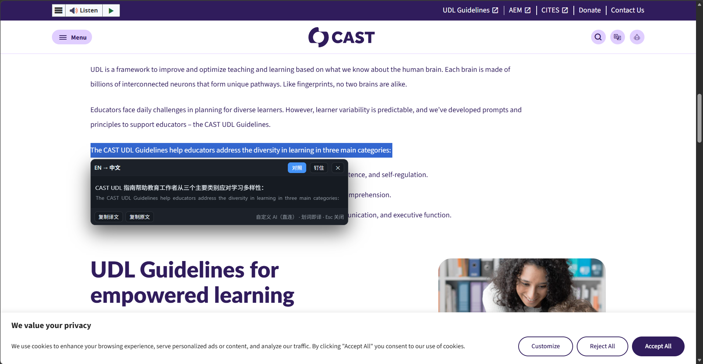
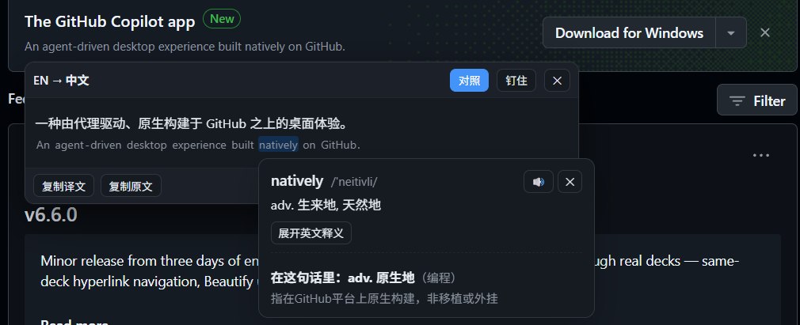
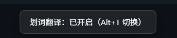

# 简易英语资料翻译工具

**在任意网页上划词即译 · 中英对照**（油猴脚本）

在**任意网页**上拖动选中文字，松手就弹出气泡，显示**逐句中英对照**的翻译。
还可以**点击原文里的单词查词典** —— 本地词典给释义，AI 判断"在这句话里是哪个意思"。

> 为「读英文技术文档的中国人」做的工具：看 GitHub README、技术博客、MDN 时不用来回切翻译网站。
> 名字里带 GitHub 是因为它最初就是为读 GitHub 而生，但它**在任何网站上都能用**。



<sub>▲ 在任意网站上划词 → 逐句中英对照。演示图用的是一篇英文文章。</sub>

---

## 它和普通划词翻译插件的区别

| | 说明 |
|---|---|
| **AI 是你自己的** | 填自己的 API key 直连，不经过第三方翻译网站，也不经过作者 |
| **代码不会被翻坏** | `npm ci`、`build.sh`、`v1.2.3`、commit SHA 原样保留；行内代码整块跳过，不会被翻译、也不会被拆碎 |
| **术语统一** | `repository`→仓库、`pull request`→拉取请求、`fork`→分叉、`branch`→分支 |
| **点词查词典** | 点原文里的单词弹卡片：音标、释义、变形、考试标签，以及**"这个词在这句话里是什么意思"**（后者只有 AI 能做，因为要看语境）。⚠️ 词典部分**需要本机代理**，只用翻译的话不用装 |
| **重复划不花钱** | 划过的内容走缓存，第二次零成本、零延迟 |

### 点单词，让 AI 说它在这句话里是什么意思



<sub>▲ 同一个词在不同句子里意思可能不同，所以这一层要交给 AI 看语境，而不是查词典。</sub>

---

## 安装（6 步，别跳步）

### 第 1 步：装油猴

- **Edge**：[Edge 加载项商店](https://microsoftedge.microsoft.com/addons/detail/iikmkjmpaadaobahmlepeloendndfphd) → 获取
- **Chrome**：[Chrome 网上应用店](https://chromewebstore.google.com/detail/tampermonkey/dhdgffkkebhmkfjojejmpbldmpobfkfo) → 添加

### 第 2 步：⚠️ 放行用户脚本（最容易漏的一步）

新版 Edge / Chrome 出于安全考虑，装完扩展后**默认不允许它运行用户脚本**，必须手动放行一次：

```
地址栏输入 edge://extensions          （Chrome 是 chrome://extensions）
  → 找到 Tampermonkey → 点「详细信息」
  → 把「允许用户脚本」开关打开
```

> **漏了这一步会怎样**：脚本能装、key 也能存，但**划词时什么反应都没有，而且不报任何错**。
> 很多人会误以为是脚本坏了，其实只是少点了这个开关。

### 第 3 步：装本脚本

**点这个链接**（油猴会自动弹出安装页）：

```
https://raw.githubusercontent.com/lithia114/easy-en-translate/main/easy-en-translate.user.js
```

然后点安装页上的「安装」。

> 如果打开是一堆代码而不是安装页：用「手动安装」——
> 复制那些代码 → 油猴图标 →「添加新脚本」→ 全选删掉模板 → 粘贴 → `Ctrl+S`。

### 第 4 步：刷新网页

按 `F5`。**不刷新的话脚本不会生效**（它是页面加载时才注入的）。

### 第 5 步：配一个 AI（二选一）

**方式 A：填自己的 key（推荐，电脑上什么都不用装）**

```
点油猴图标 →「⚙ 设置自己的 AI」
  → 选一家服务商（设置页里会直接给出「去哪拿 key」的 4 步图文）
  → 粘上 API key → 点「测试连接」→ 看到 ✅ 后点「保存」
```

> ⚠️ **必须点「保存」才算数**。只填不保存 = 没生效。
> 保存后会自动切换到直连，**并且会记住**（刷新页面、重启浏览器都还有效）。

支持任何 **OpenAI 兼容**接口，内置预设：DeepSeek、OpenAI、OpenRouter、Kimi、智谱、通义千问，也可以自己填地址。

| 服务商 | 接口地址 | 模型示例 |
|---|---|---|
| DeepSeek（便宜，推荐） | `https://api.deepseek.com` | `deepseek-chat` |
| OpenAI | `https://api.openai.com/v1` | `gpt-4o-mini` |
| OpenRouter | `https://openrouter.ai/api/v1` | `deepseek/deepseek-chat` |
| Kimi | `https://api.moonshot.cn/v1` | `moonshot-v1-8k` |
| 智谱 GLM | `https://open.bigmodel.cn/api/paas/v4` | `glm-4-flash` |
| 通义千问 | `https://dashscope.aliyuncs.com/compatible-mode/v1` | `qwen-plus` |

**方式 B：跑本机代理**

代理会复用你机器上已有的模型线路配置（也可以自己设环境变量），**额外还提供本地词典**（点词查义需要它）。

```bash
node dsh-translate-proxy.js        # 或双击「启动翻译代理.cmd」
```

---

## ⚠️ 关于隐私

**你划中的文字会发送给「你自己配置的 AI 服务商」。**

- **开着本工具时，不要划选包含个人信息的文字**（身份证、银行卡、密码、私人对话、助记词、病历等）
- 需要处理敏感内容时，先关掉工具：按 `Alt+T`（屏幕底部会提示当前状态），用完再按一次
- 内容只发给你自己配置的服务商，**不经过本工具作者，也不经过任何第三方翻译网站**
- 词典查询是**本地**完成的（需要代理），不联网、不花钱

---

## 🔒 权限与安全（说在前面）

本脚本申请了**比较宽的权限**，主动说明一下为什么，别等你自己发现。

### 为什么是 `@match *://*/*`（在所有网站运行）

因为这工具的意义就是"**你读到哪都能用**"。

如果只写 `@match https://github.com/*`，那你在技术博客、MDN、公司内网文档上就用不了。
它是通用工具，不是某个网站专用脚本。

### 为什么是 `@connect *`（允许连任意域名）

因为**接口地址是你自己填的**。

内置预设只有 DeepSeek / OpenAI / OpenRouter / Kimi / 智谱 / 通义六家，
但设置页允许你自己填地址（很多人用自建中转、公司内网网关、本地 Ollama）。
域名事先写不全，所以只能放开。

### 代码实际做了什么（你可以自己核对）

| 事实 | 位置 |
|---|---|
| **只有一处**请求带 `Authorization` 头 | `easy-en-translate.user.js` 第 1864 行 |
| 那处的目标地址是**你自己填的** `cfg.baseURL` | 同上 |
| 所有对外请求都走同一个函数 `httpRequest()`，**只有 5 个调用点** | 第 462、1394、1559、1860、1946 行 |
| 这 5 个的目标：你自己填的接口 + 本机代理（`127.0.0.1`） | — |
| **没有**任何埋点、统计、上报、错误收集 | 全文搜 `fetch` / `GM_xmlhttpRequest` 只有那一个函数 |
| 密钥存在 Tampermonkey 自己的存储里 | `GM_setValue`，第 121 行 |
| 只有在 Tampermonkey 不可用时才退回 `localStorage` | 同一个 `store` 对象 |

**一句话：除了发给「你自己配置的那家 AI」，它不往任何地方发东西。**

### 本机代理的安全边界（这部分要如实说）

代理 `dsh-translate-proxy.js` 的安全设计是：

| 做了什么 | 效果 |
|---|---|
| 只监听 `127.0.0.1` | ✅ **局域网里别的电脑连不上**，只有本机能访问 |
| 拒绝带网页 `Origin` 头的请求 | ✅ 挡住恶意网页偷用你的额度 |
| 不发任何 CORS 头 | ✅ 网页读不到响应 |

**但有一个已知的边界：它没有鉴权。**

也就是说，**你电脑上跑的任何程序**（不是网页）都能调用 `/translate`，
从而消耗你的 API 额度。这是因为：

- 油猴脚本没法安全地保管一个"只有它知道"的令牌（脚本本身是明文，谁都能看）
- 加一个要手动粘贴的令牌，会让安装流程多一步，而挡住的只是"本机已经中毒"这种情况

**所以这条没有修，而是写在这里让你知道。** 如果你的电脑上本来就跑着不明程序，
那问题比这个代理大得多。

**已经做的收敛**：`/health` 接口不再返回密钥文件的完整路径（只返回"环境变量"或"配置文件"这种标签），
避免白送一个用户名和目录结构。

---

## 快捷键

| 按键 | 作用 |
|---|---|
| `Alt+T` | 开 / 关整个工具（换 `Alt+Shift+T` 备用，有些网站会占用前者） |
| `Esc` | 关掉气泡 / 词典卡片 / 设置面板（从最上层往下关） |

**开关有记忆**：关掉后刷新页面、重启浏览器都还是关着。



<sub>▲ 按 `Alt+T` 会在屏幕底部冒一句提示，明确告诉你现在是开还是关。记不住状态的时候按一下就知道。</sub>

## 油猴菜单

| 菜单项 | 作用 |
|---|---|
| ⚙ 设置自己的 AI（填 key，免装代理） | 配置 API |
| 划词翻译：开启 / 关闭 | 同 `Alt+T` |
| 切换 中英对照 / 仅译文 | 气泡里要不要显示英文原文 |
| 切换引擎（本机代理 / 填的 key） | 临时切换（只本次会话有效；想长期切换去设置页保存） |
| 切换：点击原文单词查词典（开 / 关） | 关掉点词查词 |
| 检查本机翻译代理 | 看代理状态、模型、密钥、缓存 |
| 清空翻译缓存 / 查看引擎状态 | |

---

## 使用说明

**点原文单词查词典**：划词弹出气泡后，鼠标移到**原文那一行**的某个单词上（会微微高亮），点一下 → 旁边弹出卡片。

- 词典部分是**本地查的**（2 毫秒、不花钱）；点「💡 看这句话里的意思」才会调 AI（因为只有 AI 能判断语境）
- `npm ci`、`index.js`、`v1.2.3` 这类代码**整块跳过**，不可点
- **拖动选中**不会误触发（鼠标位移超过 5 像素就算拖选）
- 点 `committed` 会提示"原形是 commit"

---

## 出问题怎么查

| 现象 | 原因 | 怎么办 |
|---|---|---|
| 划词完全没反应 | 工具被关了 / 页面没刷新 / 油猴没开「允许用户脚本」 | 按 `Alt+T` 看底部提示 → 按 `F5` → 查扩展设置 |
| 气泡里写"还没配置 AI 接口" | 没填 key | 油猴菜单 →「⚙ 设置自己的 AI」 |
| 气泡里写"翻译代理没在运行" | 引擎选的是代理，但代理没开 | 启动代理，或在设置页填 key 改用直连 |
| 点单词查词典失败 | 词典要靠代理提供（86MB 数据） | 启动代理；卡片上也会给出「问 AI」的替代按钮 |
| 想确认一切正常 | | 油猴菜单 →「检查本机翻译代理」 |

---

## 它是怎么工作的

```
浏览器里的脚本（本仓库的 .user.js）
    ├─ 发现你划了什么 → 画气泡 → 显示译文
    ├─ 点单词 → 查词典 / 问 AI
    └─ 翻译请求 ──┬──► 你填的 AI 接口（直连，推荐）
                  └──► 本机代理 → 你的模型线路
```

**代码保护机制**：翻译前把代码、命令、路径、版本号替换成 `[[0]]` 这样的占位符，
翻完再换回来 —— 这样它们不会被模型改坏。查词典时同一套占位符还用来把代码块整块标出来、不许点。

---

## 已知限制

- **Google Docs / 表格 / Office Online 用不了**：文字画在 canvas 上，浏览器取不到选中内容
- **iframe 里的内容翻不了**（带了 `@noframes`）：比如某些网页邮箱的正文区
- **词典需要本机代理**（86MB 数据没法塞进脚本）；只用翻译的话不需要代理
- **浏览器内置页面**（`edge://`、扩展商店）无法注入

## 依赖与许可

- 本脚本：**零依赖**，只用浏览器原生 API + 油猴接口
- 本机代理：**零依赖**，只用 Node 内置模块
- 词典数据：[ECDICT](https://github.com/skywind3000/ECDICT)（MIT 许可，77 万词条）
- 本仓库：[MIT](LICENSE)

## 致谢

- [ECDICT](https://github.com/skywind3000/ECDICT) —— 开源英汉词典数据
- [Tampermonkey](https://www.tampermonkey.net/) —— 用户脚本运行环境
